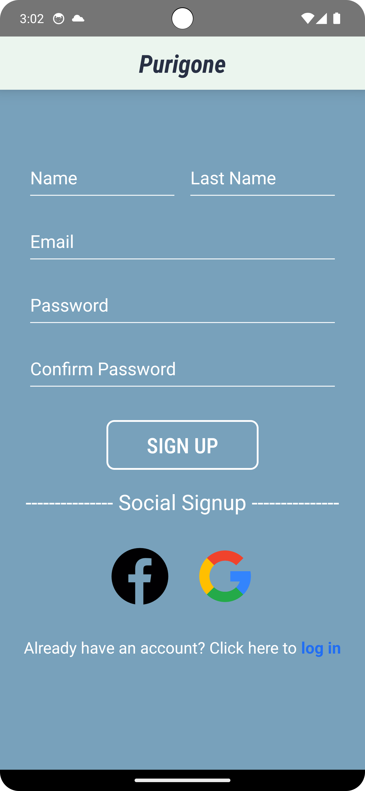
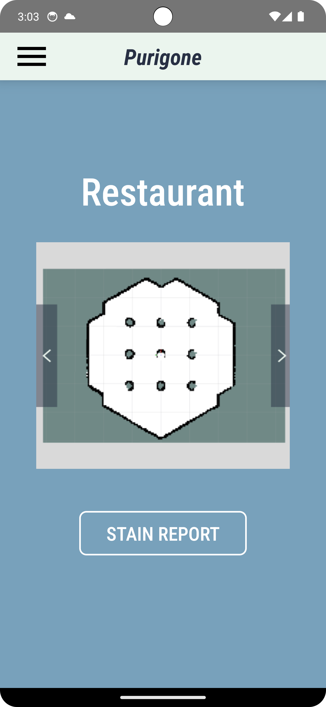
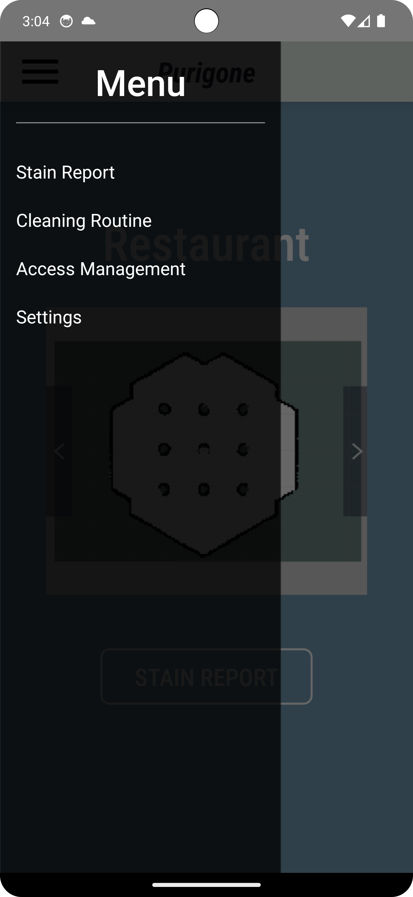
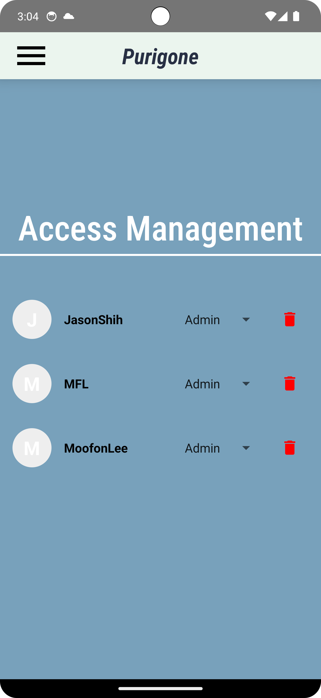
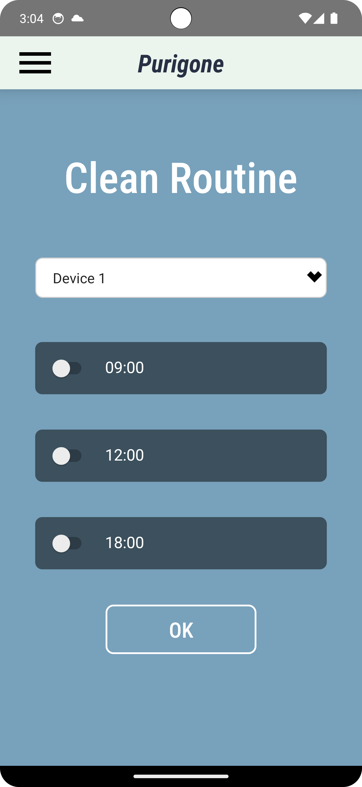
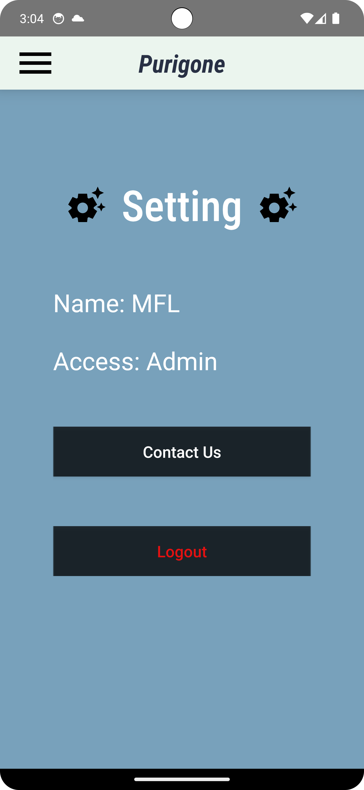

# Smart Cleaning Robot Control App

An intelligent mobile application designed to manage and control automated cleaning robots. This app enables users to report cleaning tasks, manage cleaning schedules, and control user permissions efficiently.

## Features

### 1. Authentication System
- User registration and login functionality
- Secure access control
- User session management

### 2. Dirt Report System
- Real-time dirt location reporting
- Automatic dispatch of cleaning robots
- Instant response to cleaning requests
- Interactive map interface for location selection

### 3. Permission Management
- User role configuration
- Add/modify/delete user permissions
- Hierarchical access control system
- Customizable user roles

### 4. Cleaning Schedule
- Set up daily cleaning routines
- Flexible schedule modification
- Time-based task planning
- Priority-based cleaning tasks

### 5. Settings
- User profile management
- Account settings
- Permission status display
- Logout functionality

## App Screenshots

### Login and Registration

- Secure user authentication
- New user registration
- Password protection

### Dirt Report Interface

- Easy-to-use reporting system
- Location selection
- Real-time robot dispatch

### Menu Navigation

- Intuitive navigation design
- Quick access to all features
- User-friendly interface

### Permission Settings

- Comprehensive permission management
- User role modification
- Access control settings

### Cleaning Schedule

- Schedule creation and modification
- Time slot selection
- Regular cleaning planning

### Settings Page

- Profile management
- User information display
- System settings

## Technologies Used
- Frontend: Kotlin
- Backend: Firebase
- Database: RealtimeDB/FireStore
- Authentication: FirebaseAuth
